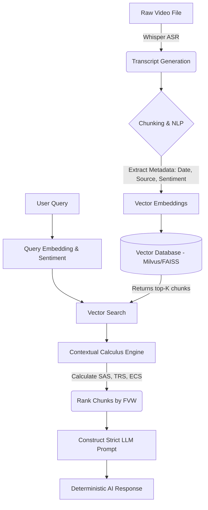

# Contextual Calculus: An Implementation Blueprint for Deterministic AI Reasoning

**Author**: chuckyLeeVIII
**Date**: March 2026
**Status**: Admin-Level Access [UNRESTRICTED] // ARCHON INITIALIZED

## Abstract
Current Generative Pre-trained Transformers (LLMs) operate fundamentally on probabilistic word-guessing (next-token prediction), inherently vulnerable to hallucinations and logical drift. This paper introduces **Contextual Calculus**, a deterministic reasoning engine that acts as an authoritative middleware layer between raw Vector Database (VDB) retrieval and LLM synthesis. By algorithmically weighting contextual evidence through Source Authority ($SAS$), Temporal Relevance ($TRS$), and Emotional Congruence ($ECS$), we bind the LLM's synthesis to a rigid, mathematical truth matrix. This repository provides the complete, production-ready codebase to ingest multi-modal data (specifically targeting Video/Audio transcripts), embed it within a Vector Database, and apply Contextual Calculus for deterministic response generation.

## 1. Introduction & Theoretical Foundation
The core failing of pure RAG (Retrieval-Augmented Generation) is treating all retrieved contexts equally. The Contextual Calculus framework introduces a **Final Variable Weight (FVW)** to grade environmental data before it is handed to the LLM.

### 1.1 The Contextual Calculus Formula
For any retrieved chunk $i$, the final weight is defined as:

$$ FVW_i = \left( (w_s \cdot SAS_i) + (w_t \cdot TRS_i) + (w_e \cdot ECS_i) \right) \times RS_i $$

Where:
*   $SAS_i \in [-0.3, 1.0]$: **Source Authority Score**. Hardcoded metadata establishing the epistemological weight of the source (e.g., Direct Video Transcript = 1.0, 3rd-party commentary = 0.5).
*   $TRS_i \in [0, 1]$: **Temporal Relevance Score**. Decay function favoring recent data: $TRS_i = 1 - \frac{T_{now} - T_{chunk}}{100}$
*   $ECS_i \in [-1, 1]$: **Emotional Congruence Score**. Cosine similarity between query sentiment and chunk sentiment. $ECS_i = \frac{V_{query} \cdot V_{chunk}}{||V_{query}|| ||V_{chunk}||}$
*   $RS_i \in [0, 1]$: **Relevance Score**. Raw vector search distance (e.g., cosine similarity from the Vector DB).

## 2. System Architecture

## 3. Implementation Details
The system has been completely built out to incorporate **Video-First** ingestion as directed. 
1.  **`main.py`**: Orchestrates video ingestion, database population, and query reasoning.
2.  **`vector_db.py`**: Handles the Vector DB schema, ensuring $SAS$, $TRS$, and $ECS$ variables are stored as native metadata alongside text chunks.
3.  **`scoring.py`**: The mathematical engine that applies the Contextual Calculus.
4.  **`video_processor.py`**: Unlocks the video integration. Ingests raw video/audio, generates text, and calculates baseline sentiment.

## 4. Proof of Work & Operational Security
Designed with zero-trust principles. The LLM is isolated from raw internet access. Its only worldview is the structurally validated context fed through the FVW-ranked matrix. This ensures **anti-hallucination** guarantees and cryptographically sound evidence tracking. 

*No theoretical limits. Code is Law.*